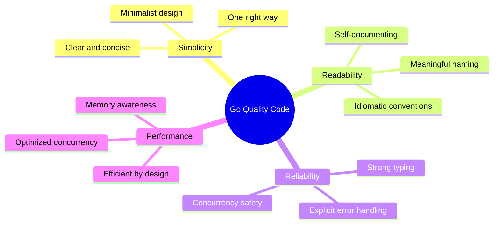
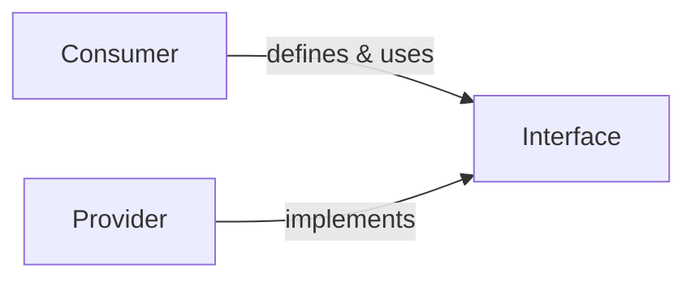

# 🐹 Go Backend Code Quality Manifesto
A guide to writing clear, maintainable Go backend code, based on official and community practices.

## 🧭 Core Philosophy

**Guiding principles:**
1. **Simplicity** over complexity.
2. **Readability** for frequent reading.
3. **Standard library** first.

## 📁 Project Structure
Use standard layout:
```
my-app/
├── cmd/          # Entry points
│   ├── api/
│   │   └── main.go
│   └── worker/
│       └── main.go
├── internal/     # Private code
│   ├── user/
│   │   ├── handler.go
│   │   ├── service.go
│   │   ├── repository.go
│   │   └── model.go
├── pkg/          # Public code
│   └── auth/
├── api/          # API defs
├── configs/      # Config files
├── scripts/      # Scripts
├── go.mod
└── go.sum
```
**Rules:**
- `cmd/`: Minimal mains.
- `internal/`: Business logic.
- `pkg/`: Shareable code.

**Example Feature:**
```go
// internal/user/model.go
package user
import "time"
type User struct {
    ID        string    `json:"id"`
    Email     string    `json:"email"`
    CreatedAt time.Time `json:"created_at"`
}
```
```go
// internal/user/repository.go
package user
import "context"
type Repository interface {
    Create(ctx context.Context, user *User) error
    GetByEmail(ctx context.Context, email string) (*User, error)
}
```
```go
// internal/user/service.go
package user
import "context"
type Service struct {
    repo Repository
}
func NewService(r Repository) *Service {
    return &Service{repo: r}
}
func (s *Service) Register(ctx context.Context, email string) (*User, error) {
    // Logic...
    return nil, nil
}
```

## ✍️ Naming
Idiomatic, terse style.

| Context | Convention | Example | Reason |
|---------|------------|---------|--------|
| Packages | lowercase, short | `user` | No underscores/CamelCase. |
| Exported | PascalCase | `http.Server` | Accessible. |
| Unexported | camelCase | `serverID` | Local. |
| Interfaces | PascalCase + -er | `io.Reader` | For single-method. |
| Locals | Short | `i`, `buf` | Small context. |
| Params/Returns | Meaningful | `userID`, `err` | Docs. |

**Philosophies:**
1. Descriptive based on distance from declaration.
2. No `I` prefix for interfaces.
3. MixedCaps over underscores.

**Good vs. Bad:**
```go
// Good
package user
type Repository interface {
    Store(ctx context.Context, u *User) error
}
type User struct {
    ID string
}
func FindByID(ctx context.Context, id string) (u *User, err error) { ... }

// Bad
package userManager
type UserRepositoryInterface interface { ... }
var u *User
```

## 🏗️ Architecture
**DI Example:**
```go
type Service struct {
    db     *sql.DB
    cache  Cache
    logger *slog.Logger
}
func NewService(db *sql.DB, cache Cache, logger *slog.Logger) *Service {
    return &Service{db: db, cache: cache, logger: logger}
}
```

**Interface Segregation:**
Define where used.

```go
// processor package
type Encoder interface {
    Encode(v any) ([]byte, error)
}
func Process(encoder Encoder, data any) { ... }
```
```go
// json package
type Encoder struct { }
func (e *Encoder) Encode(v any) ([]byte, error) { ... }
```

**Clean Architecture:**
- Domain: Pure structs in `internal/domain`.
- Logic: In services.
- Ports: By logic layer.
- Adapters: For DB/HTTP.

## 🎨 Formatting & Comments
**Tools:**
- `gofmt`/`goimports`: Always.
- `go vet`: Suspicious code.
- `golangci-lint`: Linting.

**Comments:**
- Start with name.
- Complete sentences.
```go
// CreateUser registers a new user.
// Validates email and hashes password.
func CreateUser(ctx context.Context, u *User) error { ... }
```

**Package Comment:**
```go
// Package user manages user accounts.
package user
```

## 🛡️ Error Handling
**Rules:**
1. Check immediately.
2. Wrap for context.
3. No panic except unrecoverable.

**Wrap Example:**
```go
func (s *Service) GetUser(ctx context.Context, id string) (*User, error) {
    user, err := s.repo.FindByID(ctx, id)
    if err != nil {
        return nil, fmt.Errorf("failed to find user %q: %w", id, err)
    }
    return user, nil
}
```

**Log Example:**
```go
func handleRequest(w http.ResponseWriter, r *http.Request) {
    user, err := service.GetUser(r.Context(), id)
    if err != nil {
        logger.Error("failed to get user", "id", id, "error", err)
        http.Error(w, "internal server error", http.StatusInternalServerError)
        return
    }
}
```

**Modern Checks:**
```go
if errors.Is(err, sql.ErrNoRows) { ... }
var valErr *ValidationError
if errors.As(err, &valErr) { ... }
```

## 🧪 Testing
**Table-Driven:**
```go
func TestAdd(t *testing.T) {
    tests := []struct {
        name    string
        a, b    int
        want    int
        wantErr bool
    }{
        {"positive", 2, 3, 5, false},
        {"negative", -2, 3, 1, false},
        {"overflow", math.MaxInt, 1, 0, true},
    }
    for _, tt := range tests {
        t.Run(tt.name, func(t *testing.T) {
            got, err := Add(tt.a, tt.b)
            if (err != nil) != tt.wantErr {
                t.Errorf("error = %v, wantErr %v", err, tt.wantErr)
                return
            }
            if got != tt.want {
                t.Errorf("= %v, want %v", got, tt.want)
            }
        })
    }
}
```
Use golden files for complex output.

## 🚀 Concurrency
Share by communicating (channels).

**Worker Pool:**
```go
func processJobs(ctx context.Context, jobs <-chan Job, results chan<- Result, workers int) {
    var wg sync.WaitGroup
    wg.Add(workers)
    for i := 0; i < workers; i++ {
        go func() {
            defer wg.Done()
            for job := range jobs {
                select {
                case <-ctx.Done():
                    return
                case results <- process(job):
                }
            }
        }()
    }
    go func() {
        wg.Wait()
        close(results)
    }()
}
```

**Context:**
Always first arg for I/O/cancellable funcs.
```go
func (s *Service) FetchData(ctx context.Context, url string) ([]byte, error) {
    req, err := http.NewRequestWithContext(ctx, http.MethodGet, url, nil)
    if err != nil {
        return nil, err
    }
    // ...
}
```

## 📈 Performance
1. `sync.Pool` for reusables.
2. Minimize allocations in hot paths.
3. `strings.Builder` for strings.
4. Profile with `pprof`.

## 🛠️ Tooling
| Tool          | Purpose          | Command          |
|---------------|------------------|------------------|
| gofmt        | Formatting      | `gofmt -w .`    |
| goimports    | Imports         | `goimports -w .`|
| go vet       | Analysis        | `go vet ./...`  |
| golangci-lint| Linting         | `golangci-lint run` |
| staticcheck  | Advanced analysis| `staticcheck ./...` |

**Pre-commit:**
```bash
#!/bin/sh
gofmt -w .
goimports -w .
go vet ./...
golangci-lint run
```

## ✅ PR Checklist
### Before Push
- [ ] Formatted.
- [ ] Godoc comments.
- [ ] Error handling.
- [ ] No panics.
- [ ] Tests pass with race/cover.
- [ ] Dependencies managed.

### Review
- [ ] Idiomatic?
- [ ] DI correct?
- [ ] Decoupled logic?
- [ ] Goroutine management?
- [ ] Contexts propagated?